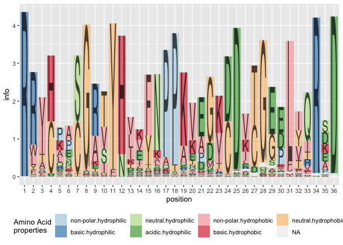
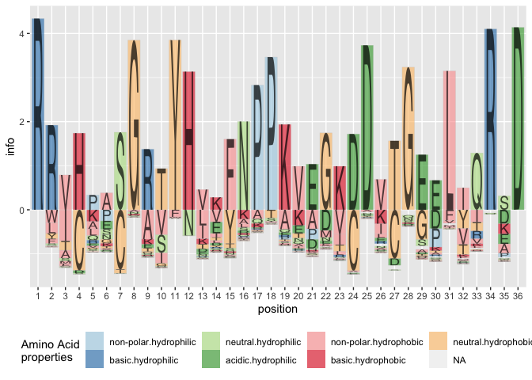
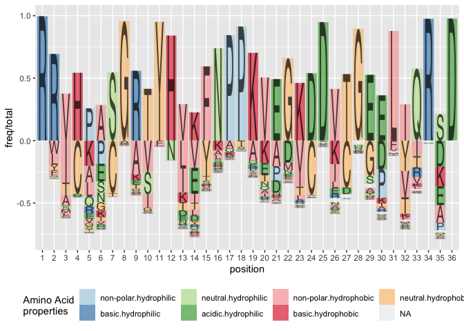
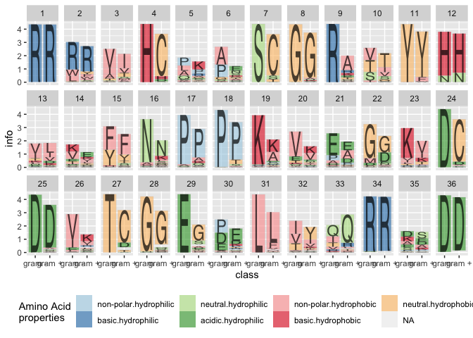
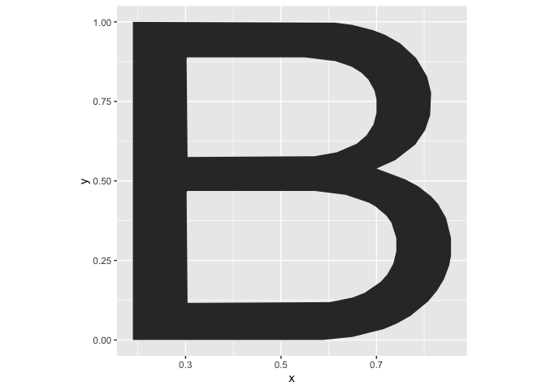
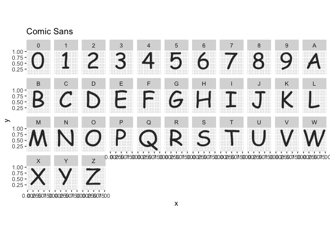
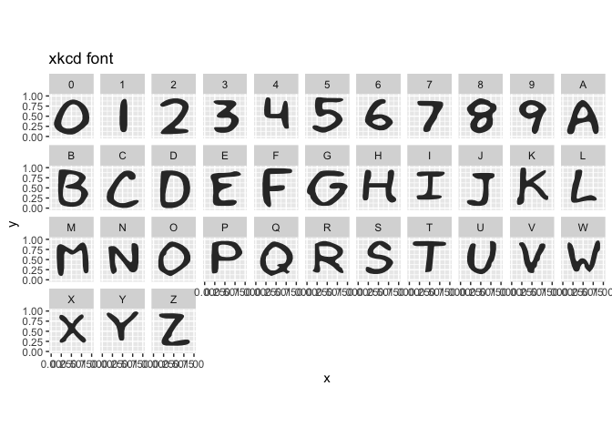
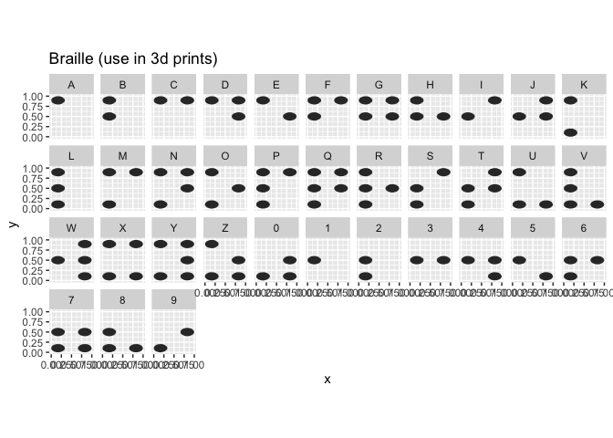

R package for creating sequence logo plots

<!-- badges: start -->
[](https://cran.r-project.org/package=gglogo) [](https://r-pkg.org/pkg/gglogo)
[](https://github.com/heike/gglogo/commits/main)
[](https://codecov.io/gh/heike/gglogo)
[](https://github.com/heike/gglogo/actions/workflows/R-CMD-check.yaml)
[](https://app.codecov.io/gh/heike/gglogo?branch=main)
<!-- badges: end -->


# Installation

`gglogo` is available from CRAN (version 0.1.4):

```r
install.packages("gglogo")
```


The development version is available from Github (0.1.9000):


```r
# install.packages("devtools")
devtools::install_github("heike/gglogo", build_vignettes = TRUE)
```

# Getting Started

Load the library


```r
library(gglogo)
```

Load a dataset containing a set of peptide sequences


```r
data(sequences)
head(sequences)
```

```
##                                peptide  class
## 1 RWTHLASGRTYNYKFNPPKQYGKDDITGEDLIQRED gram -
## 2 RWTHLNSGRTYHYKFNPPKVHGVDDVTGEPLVQRED gram -
## 3 RWTHLASGRTYNYKFNPPKQYGKDDITGEDLIQRED gram -
## 4 RWTHLASGRTYNYKFNPPKQYGKDDITGEDLIQRED gram -
## 5 RLIHQPSGRSYHEEFNPPKEPMKDDVTGEPLIRRSD gram -
## 6 RRVHPGSGRVYHVVYNPPKVEGKDDETGEELIVRAD gram -
```

Now plot the sequences in a(n almost) traditional sequence plot, the Shannon information is shown on the y axis. 


```r
library(ggplot2)
ggplot(data = ggfortify(sequences, peptide, method="shannon")) +      
  geom_logo(aes(x = position, y = info, group = element, 
     label = element, fill = interaction(Polarity, Water)),
     alpha = 0.6, position = "classic")  +
  scale_fill_brewer("Amino Acid\nproperties", palette = "Paired") +
  theme(legend.position = "bottom") 
```

<!-- -->

(Sequence) Logo plots ([Schneider & Stephens 1990](https://academic.oup.com/nar/article-abstract/18/20/6097/1141316)) are typically used in bioinformatics as a way to visually demonstrate how well a sequence of nucleotides or amino acids are preserved in a certain region.

A cognitively better version of the plot is the default, i.e. without specifying the `position` parameter, the plot defaults to aligning the largest contributor in each position along the y axis and showing all other variants in each position by a tail hanging below the axis. Longer tails indicate more variability in a position. 


```r
ggplot(data = ggfortify(sequences, peptide, method="shannon")) +      
  geom_logo(aes(x = position, y = info, group = element, 
     label = element, fill = interaction(Polarity, Water)),
     alpha = 0.6)  +
  scale_fill_brewer("Amino Acid\nproperties", palette = "Paired") +
  theme(legend.position = "bottom") 
```

<!-- -->

## Other variants

Besides the Shannon information, we could also visualize the frequencies of peptides in each position. We can either set `method = frequency`, or calculate the (relative) frequency information ourselves as:


```r
ggplot(data = ggfortify(sequences, peptide, method="shannon")) +      
  geom_logo(aes(x = position, y = freq/total, group = element, 
     label = element, fill = interaction(Polarity, Water)),
     alpha = 0.6)  +
  scale_fill_brewer("Amino Acid\nproperties", palette = "Paired") +
  theme(legend.position = "bottom") 
```

<!-- -->

Using the classic variant of alignment results in a stacked barchart of amino acids by position:


```r
ggplot(data = ggfortify(sequences, peptide, method="shannon")) +      
  geom_logo(aes(x = position, y = info, group = element, 
     label = element, fill = interaction(Polarity, Water)),
     alpha = 0.6, position="classic")  +
  scale_fill_brewer("Amino Acid\nproperties", palette = "Paired") +
  theme(legend.position = "bottom") 
```

<!-- -->


## Implementation details 

This implementation of sequence logos is a two-step process of data prepping/wrangling followed by the visualization. 
The data prepping happens in the function `ggfortify`:


```r
library(dplyr)

seq_info <- sequences %>%     # data pipeline for processing
  ggfortify(
    peptide, # variable in which the sequences are stored
    treatment = class,
    method = "shannon",
    missing_encode = c(".", "*", NA)
  )
```

`sequences` specifies the variable of the sequences in the data set, `treatment` is a (list) of grouping variables for which the (Shannon) information will be calculated in each position. For peptide sequences, the data set `aacids` is used to provide additional information on properties. 


```r
head(seq_info)
```

```
##   element  class position freq total        info        bits  Polarity
## 1       A gram -       13    2   923 0.003900781 0.003900781 non-polar
## 2       A gram -       30   31   923 0.083595755 0.083595755 non-polar
## 3       A gram +       16   33   886 0.076015635 0.076015635 non-polar
## 4       A gram -       35  135   923 0.235541625 0.235541625 non-polar
## 5       A gram +       33    2   886 0.006471744 0.006471744 non-polar
## 6       A gram -       17   27   923 0.115479912 0.115479912 non-polar
##         Water
## 1 hydrophobic
## 2 hydrophobic
## 3 hydrophobic
## 4 hydrophobic
## 5 hydrophobic
## 6 hydrophobic
```

By specifying the `treatment` parameter, the corresponding information methods are now calculated for treatments as well, and we can assess the variability/conservation of the sequence by the treatment:


```r
seq_info %>%
  ggplot() + 
  geom_logo(aes(x = class, y = info, group = element, 
     label = element, fill = interaction(Polarity, Water)),
     alpha = 0.6, position="classic")  +
  scale_fill_brewer("Amino Acid\nproperties", palette = "Paired") +
  theme(legend.position = "bottom") +
  facet_wrap(~position, ncol = 12)
```

<!-- -->


## Available alphabets


By default, the font used for logo plots is Helvetica, available as dataset `alphabet`. Each letter is implemented in form of a polygon with `x` and `y` coordinates. The variable `group` contains the corresponding letter.


```r
alphabet %>%
  filter(group == "B") %>% 
  ggplot(aes(x = x, y = y)) + geom_polygon() + 
  theme(aspect.ratio = 1)
```

<!-- -->

Besides the default alphabet, the fonts  Comic Sans, xkcd, and braille (for 3d printing) are implemented:


```r
alphabet_comic %>% 
  filter(group %in% c(LETTERS, 0:9)) %>%
  ggplot(aes(x = x, y = y)) + geom_polygon() + 
  theme(aspect.ratio = 1) + facet_wrap(~group, ncol = 11) + 
  ggtitle("Comic Sans")
```

<!-- -->

```r
alphabet_xkcd %>% 
  dplyr::filter(group %in% c(LETTERS, 0:9)) %>%
  ggplot(aes(x = x, y = y)) + geom_polygon() + 
  theme(aspect.ratio = 1) + facet_wrap(~group, ncol = 11) + 
  ggtitle("xkcd font")
```

<!-- -->

```r
alphabet_braille %>% 
  dplyr::filter(group %in% c(LETTERS, 0:9)) %>%
  ggplot(aes(x = x, y = y)) + geom_polygon() + 
  theme(aspect.ratio = 1) + facet_wrap(~group, ncol = 11) + 
  ggtitle("Braille (use in 3d prints)")
```

<!-- -->


## References

Schneider, TD, Stephens, RM (1990). [Sequence logos: a new way to display consensus sequences](https://academic.oup.com/nar/article-abstract/18/20/6097/1141316). Nucleic Acids Res, 18, 20:6097-100.

