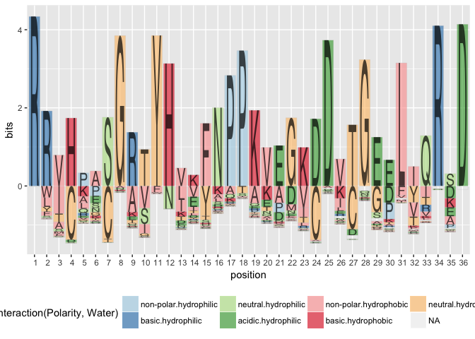

R package for creating sequence logo plots

[](https://cran.r-project.org/package=gglogo) [](http://www.r-pkg.org/pkg/gglogo) 
[](https://travis-ci.org/heike/gglogo)


```r
library(ggplot2)
library(gglogo)

data(sequences)

ggplot(data = ggfortify(sequences, peptide)) +      
  geom_logo(aes(x = position, y = bits, group = element, 
     label = element, fill = interaction(Polarity, Water)),
     alpha = 0.6)  +
  scale_fill_brewer(palette = "Paired") +
  theme(legend.position = "bottom")
```

<!-- -->
